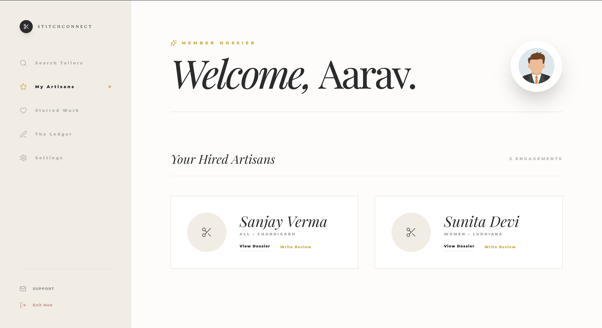
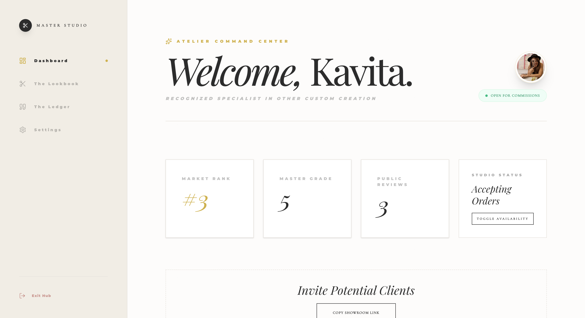
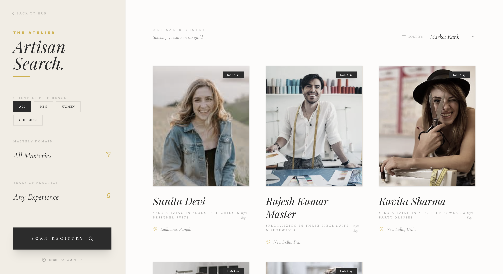
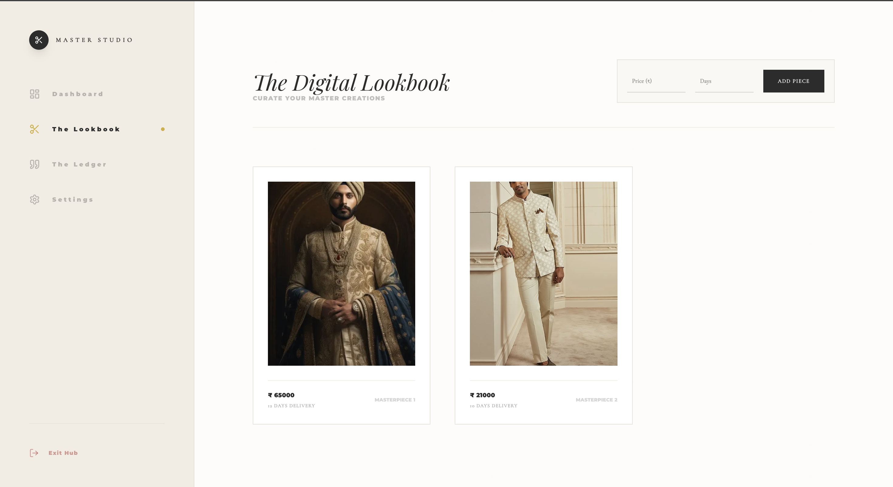
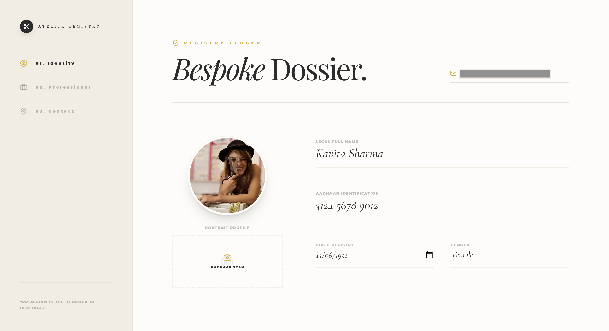

# 🪡 StitchConnect

<p align="center">
  <h1 align="center">🪡 StitchConnect</h1>

  <p align="center">
    A luxury-inspired <b>MERN Stack</b> platform connecting customers with skilled local tailors through an elegant digital marketplace.
  </p>

  <p align="center">
    Built with <b>React • TypeScript • Express • MongoDB</b>
  </p>
</p>

<p align="center">


</p>

---

# 🌐 Live Demo

### Frontend

https://stitchconnect.vercel.app

### Backend API

https://stitchconnect-api.onrender.com

---

# 📸 Application Preview

<p align="center">
  
  
</p>

<p align="center">
  
  
</p>

<p align="center">
  
  
</p>

---

# ✨ Key Highlights

- 🎨 Luxury-inspired responsive user interface
- 🧵 Digital Lookbook for showcasing tailoring work
- 🔍 Smart tailor discovery with search & filtering
- ⭐ Customer reviews and rating system
- ☁️ Cloudinary-powered image uploads
- 📧 Secure Email OTP verification
- 🔐 JWT-based authentication and authorization
- 📱 Optimized for desktop and mobile devices
- ⚡ Fast React + Vite frontend
- ☁️ Deployed using Vercel and Render

---

# ✨ Features

## 👤 Customer

- Register & Login securely
- Browse local tailors
- Filter tailors based on preferences
- View tailor profiles
- Explore tailor portfolios
- Read customer reviews
- Submit ratings & reviews
- Manage personal profile

---

## 🧵 Tailor

- Secure authentication
- Personalized dashboard
- Manage tailor profile
- Upload portfolio images
- Build a digital lookbook
- Showcase completed work
- Receive customer reviews
- Manage published designs

---

## 🔒 Authentication

- JWT Authentication
- Email OTP Verification
- Protected Routes
- Secure Session Management

---

## 📱 Responsive Design

- Mobile Friendly
- Modern UI
- Responsive Layout
- Smooth User Experience

---

# 🛠 Tech Stack

## Frontend

- React
- TypeScript
- Vite
- Axios
- React Router
- CSS

### Deployment

- Vercel

---

## Backend

- Node.js
- Express.js
- MongoDB Atlas
- Mongoose
- JWT
- Nodemailer
- Cloudinary

### Deployment

- Render

---
# 🏗️ System Architecture

```text
                        ┌──────────────────────┐
                        │     Customer /       │
                        │       Tailor         │
                        └──────────┬───────────┘
                                   │
                            HTTP Requests
                                   │
                                   ▼
                    ┌──────────────────────────┐
                    │   React + TypeScript     │
                    │      Vite Frontend       │
                    └──────────┬───────────────┘
                               │
                         Axios API Calls
                               │
                               ▼
                    ┌──────────────────────────┐
                    │   Express.js Backend     │
                    │      RESTful APIs        │
                    └───────┬────────┬─────────┘
                            │        │
              JWT Auth      │        │ Image Uploads
                            │        │
                            ▼        ▼
                   MongoDB Atlas   Cloudinary
                            │
                            │
                            ▼
                      User & Tailor Data

                    Email OTP Verification
                           ▲
                           │
                    Gmail + Nodemailer
```

---

# 📁 Repository Structure

```text
stitchconnect/

├── frontend/
│   ├── public/
│   ├── screenshots/
│   ├── src/
│   │   ├── assets/
│   │   ├── Components/
│   │   ├── customer/
│   │   ├── Tailor/
│   │   ├── api.ts
│   │   ├── App.tsx
│   │   └── main.tsx
│   ├── .env
│   ├── .gitignore
│   ├── package.json
│   ├── package-lock.json
│   ├── tsconfig.json
│   └── vite.config.ts
│
└── backend/
    ├── config/
    ├── controllers/
    ├── models/
    ├── routers/
    ├── .env
    ├── .gitignore
    ├── package.json
    ├── package-lock.json
    └── server.js
```

---

# 🚀 Getting Started

## Prerequisites

Before running the project locally, make sure you have:

- Node.js (v18 or later)
- npm
- Git
- MongoDB Atlas account (or local MongoDB)
- Cloudinary account
- Gmail account with App Password enabled

---

## 📥 Clone the Repositories

### Frontend

```bash
git clone https://github.com/malikmittal0802/stitchconnect-frontend.git

cd stitchconnect-frontend
```

---

### Backend

```bash
git clone https://github.com/malikmittal0802/stitchconnect-backend.git

cd stitchconnect-backend
```

---

# 📦 Install Dependencies

### Frontend

```bash
npm install
```

---

### Backend

```bash
npm install
```

---

# ▶️ Running the Project

Open **two terminals**.

### Terminal 1 (Backend)

```bash
cd backend

npm start
```

or

```bash
npm run dev
```

Backend will start at

```
http://localhost:3000
```

---

### Terminal 2 (Frontend)

```bash
cd frontend

npm run dev
```

Frontend will start at

```
http://localhost:5173
```

---

After both servers are running, open your browser and visit:

```
http://localhost:5173
```

You can now explore StitchConnect locally.
# ⚙️ Environment Variables

## Frontend (`.env`)

Create a `.env` file in the **frontend** directory.

```env
VITE_API_BASE_URL=http://localhost:3000
```

For production deployment:

```env
VITE_API_BASE_URL=https://stitchconnect-api.onrender.com
```

---

## Backend (`.env`)

Create a `.env` file in the **backend** directory.

```env
CLOUDINARY_CLOUD_NAME=your_cloudinary_cloud_name

CLOUDINARY_API_KEY=your_cloudinary_api_key

CLOUDINARY_API_SECRET=your_cloudinary_api_secret

MONGO_URL=your_mongodb_connection_string

GMAIL=your_email@gmail.com

GMAIL_CODE=your_gmail_app_password

PORT=3000

JWT_SECRET=your_jwt_secret

OTP_SECRET=your_otp_secret
```

> **Important**
>
> - Never commit your `.env` file to GitHub.
> - Use a **MongoDB Atlas** connection string for `MONGO_URL`.
> - `GMAIL_CODE` should be a **Google App Password**, not your Gmail password.
> - Keep all secret keys private.

---

# 🔐 Environment Variables Reference

| Variable | Description |
|-----------|-------------|
| `VITE_API_BASE_URL` | Backend API URL |
| `MONGO_URL` | MongoDB Atlas connection string |
| `CLOUDINARY_CLOUD_NAME` | Cloudinary cloud name |
| `CLOUDINARY_API_KEY` | Cloudinary API key |
| `CLOUDINARY_API_SECRET` | Cloudinary API secret |
| `GMAIL` | Gmail address used to send OTP emails |
| `GMAIL_CODE` | Gmail App Password |
| `PORT` | Backend server port |
| `JWT_SECRET` | Secret key for JWT authentication |
| `OTP_SECRET` | Secret key for OTP generation & verification |

---

# 🌍 Deployment

## 🚀 Frontend Deployment (Vercel)

The frontend is deployed on **Vercel**.

### Build Command

```bash
npm run build
```

### Output Directory

```text
dist
```

### Environment Variable

```env
VITE_API_BASE_URL=https://stitchconnect-api.onrender.com
```

---

## 🚀 Backend Deployment (Render)

The backend is deployed on **Render**.

### Build Command

```bash
npm install
```

### Start Command

```bash
npm start
```

### Environment Variables

```env
CLOUDINARY_CLOUD_NAME=

CLOUDINARY_API_KEY=

CLOUDINARY_API_SECRET=

MONGO_URL=

GMAIL=

GMAIL_CODE=

PORT=3000

JWT_SECRET=

OTP_SECRET=
```

---

# 🔒 Security Features

StitchConnect follows several security best practices:

- 🔐 JWT-based authentication
- 📧 Email OTP verification
- 🔑 Protected API routes
- ☁️ Secure Cloudinary image storage
- 🚫 Sensitive credentials stored using environment variables
- 🔒 Passwords securely hashed before storage
- 🌐 CORS-enabled backend for controlled frontend communication

---

# 📊 Project Highlights

| Feature | Status |
|----------|:------:|
| Customer Authentication | ✅ |
| Tailor Authentication | ✅ |
| Customer Dashboard | ✅ |
| Tailor Dashboard | ✅ |
| Tailor Discovery | ✅ |
| Tailor Lookbook | ✅ |
| Customer Reviews | ✅ |
| Write Reviews | ✅ |
| Profile Management | ✅ |
| Cloudinary Uploads | ✅ |
| Email OTP Verification | ✅ |
| Responsive UI | ✅ |
| Live Deployment | ✅ |
